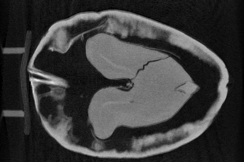
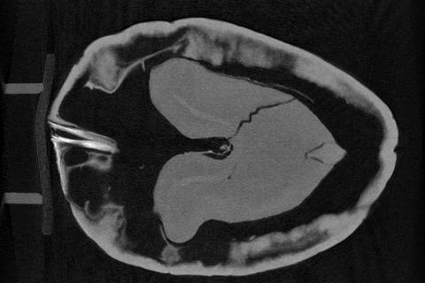
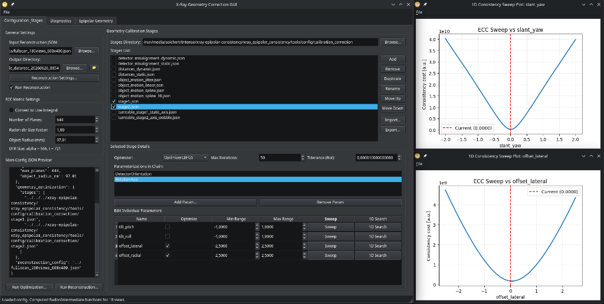
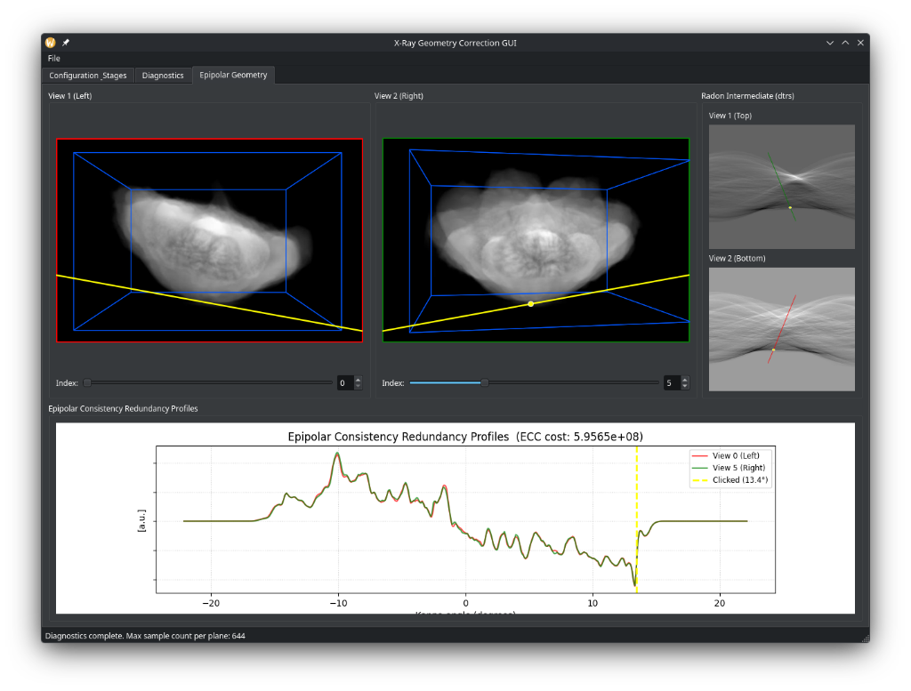
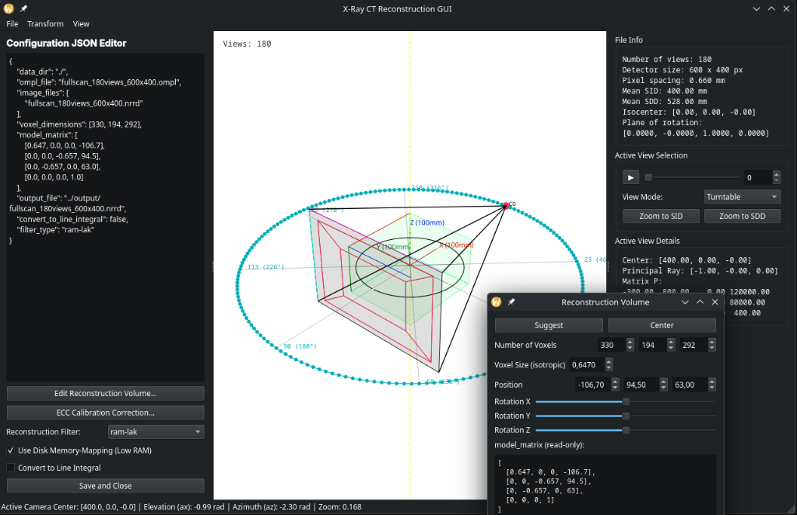
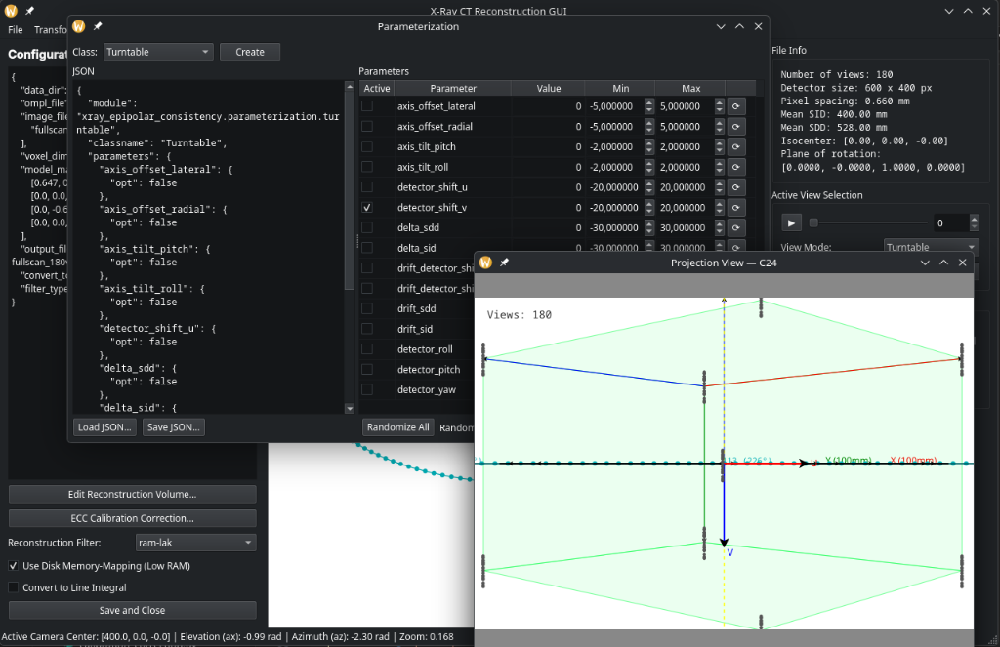
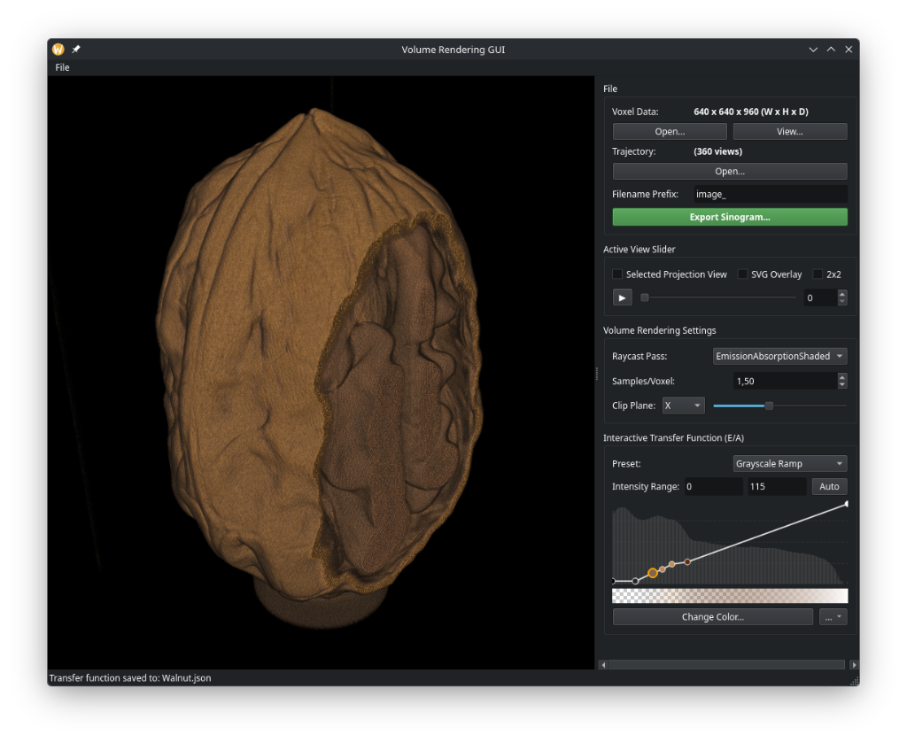

# ct-calibration-correction-gui

**GUI for X-Ray Geometry Calibration and Motion Correction**  
Based on [xray-epipolar-consistency](https://github.com/aaichert/xray-epipolar-consistency) and [ct-recon-fdk-astra](https://github.com/aaichert/ct_recon_fdk_astra).

The tool helps you set up, run, and inspect multi-stage geometry optimization for cone-beam CT scans using Epipolar Consistency Conditions (ECC), and to hand off the corrected trajectory directly to the reconstruction GUI.

<p align="center">
  <a href="https://www.youtube.com/watch?v=fl2Iy_WEyJA">
    
  </a>
</p>

### Real Walnut Reconstruction (Misaligned vs. Corrected)
<p align="center">
  
  
</p>

---

## Features

|  | What it does |
|-----|-------------|
| **Batteries Included**   | Repo includes a synthetic data set and instructions to download and use a real walnut dataset.
| **Importing Raw CT Data** | Set up you reconstruction job through [ReconstructionGUI](https://github.com/aaichert/ct_recon_fdk_astra), which is automatically installed along with this GUI.|
| **Configuration & Stages** | Load a reconstruction JSON, configure undersampling, define optimization stages (parameterizations, optimizer, tolerance), and run the optimization. |
| **Diagnostics** | Compute pairwise ECC cost/weight/sample-count matrices and inspect per-pair redundancy profiles. |
| **Epipolar Geometry** | Interactively browse projection pairs, visualize epipolar lines and Radon intermediates (dtrs), and inspect ECC redundancy profiles. |

## Screenshots

<p align="center">
  
  <br/>
  <em>Geometry Correction GUI Optimization Tab</em>
</p>

<p align="center">
  
  <br/>
  <em>Epipolar Geometry Pair Inspection & Redundancy Profiles</em>
</p>

<p align="center">
  
  <br/>
  <em>Reconstruction GUI 3D Geometry Orbit</em>
</p>

<p align="center">
  
  <br/>
  <em>Reconstruction Trajectory Parameterization Editor</em>
</p>

<p align="center">
  
  <br/>
  <em>Volume Rendering GUI</em>
</p>

---

## Prerequisites

The ECC cost function is implemented in C++/CUDA, and reconstruction uses the ASTRA Toolbox (also CUDA-based). You need a C++ compiler, CMake, the CUDA Toolkit, and ASTRA **before** installing the Python packages.

**Ubuntu / Debian**
```bash
sudo apt update
sudo apt install build-essential cmake nvidia-cuda-toolkit
pip install astra-toolbox
```

**Arch Linux / CachyOS**
```bash
sudo pacman -Sy base-devel cmake cuda
pip install astra-toolbox
```

**Windows**
1. Install **Visual Studio** (Community Edition) with the **"Desktop development with C++"** workload.
2. Install **CMake** from [cmake.org](https://cmake.org/download/) — select "Add CMake to the system PATH".
3. Install the **CUDA Toolkit** from the [NVIDIA Developer website](https://developer.nvidia.com/cuda-downloads).
4. ASTRA — official pip wheels are not available on Windows. Download the precompiled binary zip from the [ASTRA Toolbox downloads page](http://www.astra-toolbox.com/), extract it, and copy the `astra` module directory into your virtual environment's `Lib/site-packages/`.

See the [ASTRA Toolbox Installation Guide](https://www.astra-toolbox.com/docs/install.html) for full details.

---

## Installation

### 1. Install git-sourced dependencies

The two core libraries require a C++/CUDA build and will never be on PyPI.
They are listed in `requirements-git.txt` for convenience:

> **Note:** This step triggers a CMake/CUDA compilation — make sure the
> CUDA Toolkit is installed first (see Prerequisites above).

```bash
pip install -r requirements-git.txt
```

This installs:
- **xray-epipolar-consistency** — ECC cost function (CUDA) + calibraion correction
- **ct-recon-fdk-astra** `[gui]` — FDK reconstruction + `ReconstructionGUIPy` entry-point

### 2. Install this package with editable mode

```bash
# Clone and install from the repo directory
git clone https://github.com/aaichert/ct_calibration_correction_gui.git
cd ct_calibration_correction_gui
pip install -e .
```

## Getting Started

To get started, we recommend starting with the **ReconstructionGUI**, as it features a convenient import dialog for raw CT data. When both packages are installed in the same Python environment, the **ReconstructionGUI** will feature an **"ECC Calibration Correction"** button that passes the dataset straight to this calibration GUI.

on Linux:

either Arch Linux / CachyOS
```bash
sudo pacman -Sy base-devel cmake cuda
```
or Ubuntu / Debian
```bash
sudo apt update
sudo apt install build-essential cmake nvidia-cuda-toolkit
```

and then:
```bash
mkvirtualenv install_test
workon install_test
pip install astra-toolbox
git clone git@github.com:aaichert/ct_recon_fdk_astra.git
cd ct_recon_fdk_astra/
pip install -e ".[gui]"
cd ..
git clone git@github.com:aaichert/xray-epipolar-consistency.git
cd xray-epipolar-consistency
pip install -e .
cd ..
git clone git@github.com:aaichert/ct_calibration_correction_gui.git
cd ct_calibration_correction_gui
pip install -e .
```

## Usage

```bash
# Launch with or without command line arg
GeometryCorrectionGUI [file.json]
```


### Reconstruction JSON format

The input file is a `ct-recon-fdk-astra` reconstruction config. Minimum required fields:

```json
{
  "ompl_file": "trajectory.ompl",
  "image_files": ["projections0.tif, projections1.tif, ..., projectionsN-1.tif"],
  "data_dir": "./",
  "voxel_dimensions": [200, 200, 200],
  "model_matrix": [[1,0,0,0],[0,1,0,0],[0,0,1,0],[0,0,0,1]]
}
```

## File Writing & Naming Conventions Summary

Below is a visual tree of the updated CT dataset structure, followed by a detailed summary of all files created/modified by the geometry correction tool, reconstruction tool, and their respective GUIs.

```text
my_dataset
├── images
│   ├── file00001.tif
│   ├── file00002.tif
│   ├── ...
│   └── file00360.tif
├── ecc_YYYYMMDD_HHMM
│   ├── stages
│   │   ├── stage1.json
│   │   └── stage2.json
│   ├── geometry_correction.json
│   ├── trajectory_initial.ompl
│   ├── trajectory_optimized.ompl
│   ├── parameterization.json
│   ├── reconstruction.json
│   └── report.html
├── reconstruction_ecc_YYYYMMDD_HHMM.nrrd
├── reconstruction.nrrd
├── reconstruction.json
└── trajectory.ompl
```

### Geometry Correction Tool (`geometry_correction.py` & GUI)

Assuming the original reconstruction config is `/path/to/my_dataset/reconstruction.json` and its `output_file` is `reconstruction.nrrd`:

| File | Target Location | Description |
| :--- | :--- | :--- |
| **Geometry Config** | `my_dataset/ecc_YYYYMMDD_HHMM/geometry_correction.json` | The main configuration for the geometry optimization run (replaces `config_geometry.json`). |
| **Stages Config** | `my_dataset/ecc_YYYYMMDD_HHMM/stages/<stage_name>.json` | Stage JSON files. **Only** checked/active stages are copied/written here with their original filenames (replaces `calibration_correction/` directory). |
| **Initial Trajectory** | `my_dataset/ecc_YYYYMMDD_HHMM/trajectory_initial.ompl` | The original projection matrices. |
| **Optimized Trajectory** | `my_dataset/ecc_YYYYMMDD_HHMM/trajectory_optimized.ompl` | The corrected projection matrices (replaces `optimized_trajectory.ompl`). |
| **Adapted Reconstruction JSON** | `my_dataset/ecc_YYYYMMDD_HHMM/reconstruction.json` | Contains the parameters for running reconstruction with the optimized trajectory. |
| **Optimized Parameterization** | `my_dataset/ecc_YYYYMMDD_HHMM/parameterization.json` | The chain of parameters saved as JSON (replaces `optimized_parameterization.json`). |
| **HTML Report** | `my_dataset/ecc_YYYYMMDD_HHMM/report.html` | Summary report. Contains all plots and preview slices embedded directly in-memory (no SVG or PNG files are written to disk). |

### Reconstruction Tool (`reconstruct.py` & GUI)

When run using the adapted JSON configuration files:

| File | Target Location | Description |
| :--- | :--- | :--- |
| **Optimized Volume** | `my_dataset/reconstruction_ecc_YYYYMMDD_HHMM.nrrd` | Reconstructed optimized volume. Placed next to `reconstruction.nrrd` with `ecc` folder suffix. |
| **Initial Volume** | `my_dataset/reconstruction.nrrd` | Plain initial reconstruction volume, only created if it does not exist yet. |
| **Temp Attenuation Sino** | `my_dataset/` or system temp | Memory-mapped temporary sinogram (`.bin`) cleaned up upon completion (if `use_memmap=True`). |

---

## License

Apache 2.0 — see [LICENSE](LICENSE).
